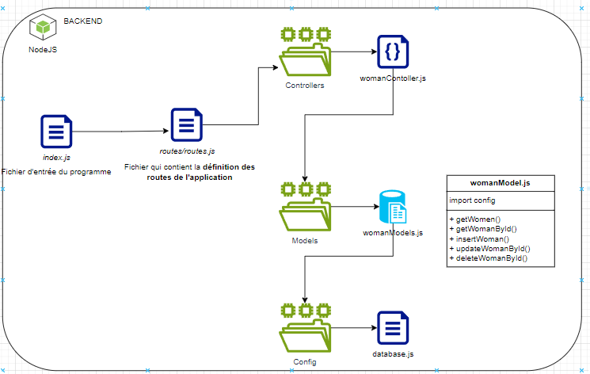

# Node JS REST API with Express

v0.1

# Pré-requis

- Node version 20 MINIMUM!
- Docker et docker-compose

---



## Etapes

- Création de l'application Backend Node JS
  - Initialisation de l'application Backend Node JS
  - Dépendances globales (sur le système)
      - Dépendances : 
        - express mysql2 cors body-parser dotenv
  – Connect to Database
      - Création d'un fichier de configuration de connexion à la base de données
      - Vérification
  4 – Create Controller, Model and Route
      - Création d'un script principal
      - Création des routes
          - Les routes seront définies dans un fichier de route spécifique
      - Création du modèle
          - Le modèle sera défini dans un fichier de modèle spécifique
          - Le modèle contiendra les fonctions pour effectuer les opérations CRUD basiques
      - Création du contrôleur
          - Le contrôleur sera défini dans un fichier de contrôleur spécifique
          - Le contrôleur contiendra les actions spécifiques de chaque route
          - Chaque action du contrôleur appellera les fonctions du modèle
  5 – Update index.js
      - Importer les dépendances
      - Créer une instance d'Express
      - Définir le port
      - Définir les routes
      - Lancer le serveur
  6 – Start Node JS Express + MySQL App
  7 - Test API using Postman

---

## 1. Create Database and Table


---

# Initialisation de l'application Backend Node JS

Dans le dossier backend

```bash
npm init -y
```

> Le fichier va générer un fichier **package.json** qui contiendra les informations du projet Node.

---

# Dépendances

On installe les dépendances dont on aura besoin dans ce projet.

```bash
npm install express body-parser mysql2 cors
```

> Les dépendances seront ajoutées dans **package.json** et installées dans le dossier **node_modules**. 
 
---

# Lecture du fichier d'environnement

Dans le fichier **index.js**, on va aller chercher les variables d'environnement placées dans le fichier **.env.backend**.

```javascript
import dotenv from "dotenv";

// Load dotenv file
const env = dotenv.config( { path: '.env.backend' } );
console.log(env);
```
> Vous devez avoir accès à toutes les variables d'environnement.

> **En cas d'erreur** sur l'import:
> Modifier le fichier package.json et ajoutez la ligne suivante:
```json
"type": "module"
```


> Cette méthode **sera ensuite déplacée dans un autre fichier**.
> C'est présenté ici uniquement pour la démonstration.
    
--- 

# Connexion à la base

Création d'un fichier de configuration de connexion à la base de données.

```bash
touch config/database.js
```

```javascript
import mysql from "mysql2";
import dotenv from "dotenv";

// Load dotenv file
const env = dotenv.config( { path: '../.env.docker' } );
console.log(env);

// create the connection to database
const db = mysql.createConnection(
    {
        host:           env.parsed.DB_HOST_FOR_NODE,
        port:           env.parsed.DB_PORT_FOR_NODE,
        user:           env.parsed.DB_USER,
        password:       env.parsed.DB_PASSWORD,
        database:       env.parsed.DB_NAME
    });

export default db;
```

> Notez à la fin la ligne **export default db**.
> Cela permettra d'importer la connexion à la base de données dans d'autres fichiers.


C'est ce qu'on va faire dans le fichier **index.js**.

```javascript
/* Possible grâce au export default db du fichier config/database.js */
import db from "./config/database.js";

db.query("SELECT * FROM women", (err, result) => {
    if(err) {
        console.log(err);
    } else {
        console.log(result);
    }
});
``` 

Vous devriez avoir le résultat de la requête qui apparraît dans la console.

> En cas d'erreur, assurez vous d'avoir Node en version 20 minimum!

> Cette méthode **sera ensuite déplacée dans un autre fichier**.
> C'est présenté ici uniquement pour la démonstration.
 
---

# Création de la route

On va créer un fichier **routes/routes.js**.

```bash
mkdir routes
touch routes/routes.js
```

```javascript
import express from "express";

// init express router
const router = express.Router();

// Get All Woman
router.get('/women', (req, res) => {
    res.send('Get All Women');
});

// export default router
export default router;
```

Dans le fichier **index.js**, on va importer le fichier de route.

> Avant de poursuivre, videz le fichier **index.js**.

```javascript
// import express
import express from "express";
import router from "./routes/routes.js";

// init express
const app = express();

// use router
app.use(Router);

app.listen(5000, () => console.log('Server running at http://localhost:5000/women'));
```

Testez l'accès à la route depuis votre navigateur.

---

# Création du controller

On va créer un fichier **controllers/womenController.js**.

```bash 
mkdir controllers
touch controllers/womenController.js
```

```javascript
// import connection
import db from "../config/database.js";

// Action Get All Women
export const showWomen = (req, res) => {
    db.query("SELECT * FROM women", (err, results) => {
        if(err) {
            console.log(err);
        } else {
            console.log(results);
        }
    });
}
```

L'action **showWomen** va permettre de récupérer toutes les femmes de la base de données en appelant directement la base de données.

> Ultérieurement, ce sera au modèle de faire la requête à la base de données, et non au controller.

On modifie la route dans **routes/route.js** pour appeler le controller.

```javascript
import express from "express";

// import function from controller
import { showWomen } from "../controllers/womanController.js";

// init express router
const router = express.Router();

// Get All Woman
router.get('/women', showWomen);
```

La route appelle la fonction **showWomen** du controller **womenController.js**.


https://www.tutsmake.com/vue-js-crud-node-js-express-mysql-example/