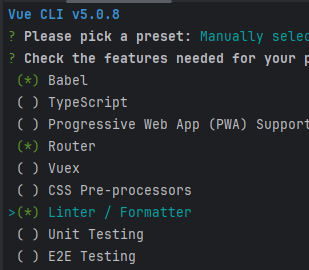

# Lancement du docker

Le fichier docker-compose.yml est configuré pour lancer les services:
- mariadb
- phpmyadmin

```bash
docker-compose up -d --env-file .env.docker
```

> Vous devez avoir un service mariadb et un service phpmyadmin fonctionnels.
> La base de données doit déjà être remplie.

> 


PHPMyAdmin
http://localhost:8088/

---


# Dépendances globales (sur le système)

Install de vue-cli
```bash
npm install -g @vue/cli
```

# Création du projet

Pour créer un nouveau projet Vue
```bash
vue create vue-women-in-tech
```


Choisir le preset **Manually select features**




---

# Dépendances du projet

# Lancement

## Backend

    ```bash
    cd backend
    node index.js
    ```

## Frontend

```bash
cd frontend
npm run serve
```

# Accès

App
http://localhost:8080/
PHPMyAdmin
http://localhost:8088/